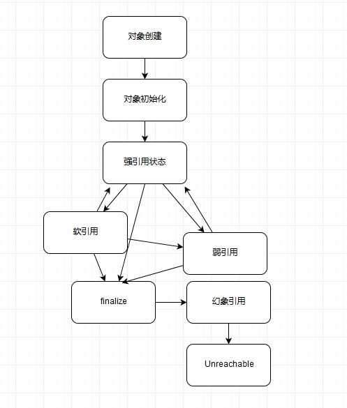

# JAVA语言中的引用类型

#### **一、强引用**

> * 一个对象只要存在强引用就不会在JVM进行GC的时候回收掉；就算发生内存溢出也不会回收。

```java
String str = new String("abc");
```

#### **二、软引用（SoftReference）**

>* JVM在发生GC时候；如果一个对象存在软引用，则在内存充足的情况下垃圾收集器不会回收该对象，内存不足时会回收该对象；
>
>* 从 Java 1.3.1 开始，提供了 -XX:SoftRefLRUPolicyMSPerMB 参数，我们可以以毫秒（milliseconds）为单位设置。比如，下面这个示例就是设置为 3 秒（3000 毫秒）。
>
>* 这个剩余空间，其实会受不同 JVM 模式影响，对于 Client 模式，比如通常的 Windows 32 bit JDK，剩余空间是计算当前堆里空闲的大小，所以更加倾向于回收；而对于 server 模式 JVM，则是根据 -Xmx 指定的最大值来计算。
>
>* 本质上，这个行为还是个黑盒，取决于 JVM 实现，即使是上面提到的参数，在新版的 JDK 上也未必有效，另外 Client 模式的 JDK 已经逐步退出历史舞台。所以在我们应用时，可以参考类似设置，但不要过于依赖它。
   
```java
public static void main(String[] args) throws InterruptedException { 
    String str = new String("string object");
    ReferenceQueue<String> referenceQueue = new ReferenceQueue<>();
    SoftReference<String> softReference = new SoftReference<>(str, referenceQueue);
    System.out.println("softReference:" + softReference.get());
    
    str = null;
    System.gc(); 
    
    Reference reference = referenceQueue.remove(); 
    if (reference != null) {
     System.out.println("referenceQueue:" + reference.get());
    } 
  }
```

```
可用于实现内存敏感的缓存系统
```

#### **三、弱引用（WeakReference）**
    

>* 当一个对象只有弱引用时，在JVM发生GC时该对象会被回收掉。

```java
public static void main(String[] args) throws InterruptedException {    
    String str = new String("string object");    
    ReferenceQueue<String> referenceQueue = new ReferenceQueue<>();    
    WeakReference<String> weakReference = new WeakReference<>(str, referenceQueue);
    System.out.println("weakReference:" + weakReference.get());
    
    str = null;    
    System.gc();   
    
    Reference reference = referenceQueue.remove();    
    if (reference != null) {      
      System.out.println("referenceQueue:" + reference.get());
    }
  }
```

#### **四、幻象引用（PhantomReference）**
     

>*    当一个对象只有幻象引用时，在发生GC时对象的finalize方法已经执行完成后，该对象会被加入到ReferenceQueue中，此时该对象并没有被回收；当JVM再次发起GC时，该对象即被回收。

```java
public static void main(String[] args){
    Object counter = new Object();
    ReferenceQueue refQueue = new ReferenceQueue<>();
    PhantomReference<Object> p = new PhantomReference<>(counter, refQueue);
    
    counter = null;
    System.gc();
    
    try {
      // Remove 是一个阻塞方法，可以指定 timeout，或者选择一直阻塞
      Reference<Object> ref = refQueue.remove(1000L);
      if (ref != null) {
           // do something
       }
     } catch (InterruptedException e) {
       // Handle it
     }
}
```

>* 可用于在JVM回收对象之前进行某些资源回收的操作；如Mysql连接中的ConnectionPhantomReference引用，Mysql驱动会在创建数据库连接时对每个Connection创建幻象引用，当连接回收时，通过幻象引用检查连接是否已经关闭等, 如下代码所示： 
com.mysql.cj.jdbc.NonRegisteringDriver.ConnectionPhantomReference
```java
static class ConnectionPhantomReference extends PhantomReference<ConnectionImpl> {

     private NetworkResources io; 
     
     ConnectionPhantomReference(ConnectionImpl connectionImpl, ReferenceQueue<ConnectionImpl> q) {  
       super(connectionImpl, q); 
       this.io = connectionImpl.getSession().getNetworkResources();
     }
     
     void cleanup() {
       if (this.io != null) {
          try {
            this.io.forceClose();
           } finally {
             this.io = null;
           }
        }
      }
   }
```

#### **五、Reachability Fence**
     

>*    除了前面介绍的几种基本引用类型，我们也可以通过底层 API 来达到强引用的效果，这就是所谓的设置 reachability fence
>
>*    为什么需要这种机制呢？考虑一下这样的场景，按照 Java 语言规范，如果一个对象没有指向强引用，就符合垃圾收集的标准，有些时候，对象本身并没有强引用，但是也许它的部分属性还在被使用，这样就导致诡异的问题，所以我们需要一个方法，在没有强引用情况下，通知 JVM 对象是在被使用的。说起来有点绕，我们来看看 Java 9 中提供的案例。
>
>*    这里提供一个真是有关reachability的例子，清楚说明对方法的调用并不能保证对象存活; [关于Reachability Fence的详细说明](http://mail.openjdk.java.net/pipermail/jdk-dev/2018-October/002067.html)

```java
class Resource {
 private static ExternalResource[] externalResourceArray = ...
 int myIndex; Resource(...) {
     myIndex = ...
     externalResourceArray[myIndex] = ...;
     ...
 }
 protected void finalize() {
     externalResourceArray[myIndex] = null;
      ...
  }
  public void action() {
  try {
      // 需要被保护的代码
      int i = myIndex;
      Resource.update(externalResourceArray[i]);
  } finally {
      // 调用 reachbilityFence，明确保障对象 strongly reachable
      Reference.reachabilityFence(this);
  }
  }
  private static void update(ExternalResource ext) {
     ext.status = ...;
  }
 } 
 
 public class ResourceTest {
   public static void main(String[] args){
      new Resource().action();
   }
 }
```

**注：强引用、软引用、弱引用三者之间可以相互转换，如下图所示：**


